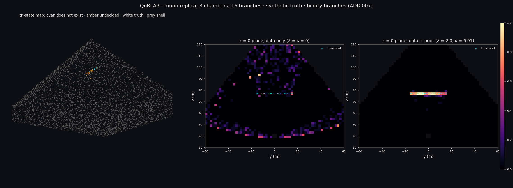

# QuBLAR

**An Ising photonic engine.** QuBLAR sends probes through a scene, counts what comes back,
and emits the **truth alongside every measurement**, so reconstruction algorithms can be
scored against what actually happened rather than against each other.
- The probes: photons (LiDAR, non-line-of-sight imaging) and cosmic-ray muons.
- The newest reconstruction: an Ising/QUBO engine that finds what is *not* there.

*Quantum-inspired, not quantum.* The branch ensemble borrows Everett's picture (many
complete worlds, weighted), without its ontology. The solver is classical annealing, and no
qubits are involved.

It began as a LiDAR simulator:

Most range data is a point cloud: one distance per beam, with whatever produced it already
thrown away. A real beam has angular divergence, so its footprint at range covers an area
that can contain several surfaces at different distances — and the interesting physics
lives exactly where it straddles an edge. This simulator records the full time-resolved
return, and next to it the list of surfaces that made it.

Built on an RTX 5060 Ti (Blackwell, sm_120) with CUDA 13.0 and OptiX 9.1.0.

---

## What it does

| | |
|---|---|
| **Geometry** | A hand-written CUDA BVH, and the same queries through the RT cores via OptiX. The two agree on 1048576 rays across five scene sizes and two coherence regimes. |
| **Sensor** | Beam divergence with stratified solid-angle sampling, the extended-target range equation derived rather than copied, and a bin-integrated Gaussian pulse. |
| **Truth** | Per beam: the distinct surfaces the footprint struck, with range, incidence and the fraction of beam energy each returned. |
| **Detector** | Single-photon (SPAD/TCSPC): inhomogeneous Poisson arrivals by inverting the cumulative rate, non-paralysable dead time, ambient background. Produces real pile-up. |
| **Reconstruction** | Peak pick, matched filter, greedy deconvolution, plus Coates pile-up correction — each scored against truth on detection, false alarms, bias and RMSE, never combined into one number. |
| **Multi-bounce** | Confocal three-bounce transport, and non-line-of-sight reconstruction by filtered backprojection. |
| **External validation** | The released confocal captures of O'Toole/Lindell/Wetzstein (Nature 2018) run through the same consumers: a port of the authors' light-cone transform (agreeing with their pipeline to 6.7e-8), phasor-field reconstruction, and the backprojection baseline -- scored against truth on a synthetic replica of the same rig. |

## Some measured results

- **RT cores run traversal 1.9–6.7× faster** than the CUDA baseline, rising with scene
  complexity and much larger for incoherent rays than coherent ones
  ([details](docs/RESULTS-phase2.md) — including the part where the baseline got *slower*
  when it was made correct, which is where some of that ratio came from).
- **Pile-up costs 3.3 cm of range, systematically short.** Coates correction removes
  essentially all of it ([details](docs/RESULTS-phase3.md)).
- **An object nobody can see is located to 1.25 cm** from nothing but the timing of light
  that bounced off a wall ([details](docs/RESULTS-phase3b.md)).
- **The captured Nature-2018 confocal data reconstructs here.** A backprojection written
  from an independent transport model lands 1 cm from the published LCT result on the
  same data, and the ported LCT matches a numpy mirror of the authors' MATLAB to
  6.7e-8 ([details](docs/RESULTS-phase4.md) — including the phasor field, which is
  implemented, honest about not yet working, and expected to fail).

## The Ising engine, in one figure (ADR-007)



This is a synthetic ScanPyramids replica with **known truth**: a 30 m void at z = 77 m, seen
by three point-like muon chambers.
- **Continuous MLEM** puts its deficit peak 30 m away at every exposure. The apex artifact
  is structural.
- **The binary engine**, at 2²⁷ muons per chamber, marks 11 voxels "does not exist". All 11
  are correct, the centroid is 0.1 m from the void's axis, and the empty pyramid yields zero
  false voids.
- **The evidence budget sets the threshold.** The data pay 303 / 466 / 773 / 1520 nats for
  the true void at 2²⁵ to 2²⁸ muons, against the prior's 421. The void appears exactly when
  the data win.
- **The data alone** say only that something is missing along these rays. The prior (voids
  are rare and compact) chooses where, and those voxels are labelled prior-driven.

For the 20 most likely ghost bits, the exact local posterior (all 2²⁰ branches) calls every
one void, at p ≥ 0.987. Blaze compresses that 20-way tensor about 26,000× (TT rank 1–2)
and returns every marginal without rebuilding it. The compression is that large because
the answer is sharp; weaker data would raise the ranks. See
[RESULTS-phase6](docs/RESULTS-phase6.md).

## Build and check

Windows only, and deliberately: OptiX does not work under WSL on this machine
(`libnvoptix.so.1` there is a 14 KB stub), and building the baseline and the accelerated
path with different compilers would put a confound inside the one number they exist to
produce.

```bat
build.bat        REM vcvars64, then nvcc for all five binaries
check.bat        REM every invariant; non-zero exit if any fails
sanitize.bat     REM compute-sanitizer memcheck and racecheck
```

`check.bat` verifies with `cuobjdump` that every binary really contains `sm_120` code
before reporting a single number, because `-arch=sm_120` is a request and not a
confirmation.

## External data (Phase 4)

`check_external` runs without the captures, but its data section **fails by design**
(`SKIP (no data)`) when they are absent: an all-green must be earned. To earn it:

1. Download the release from the [project page](https://www.computationalimaging.org/publications/confocal-non-line-of-sight-imaging-based-on-the-light-cone-transform/)
   ("LCT MATLAB code and data") and unzip it to `data/ext/lct/`.
2. `python tools/mat_to_raw.py data/ext/lct/confocal_nlos_code` — converts the scenes
   to `data/ext/*.bin` + `.meta`.
3. `python tools/lct_reference.py data/ext diffuse_s --dump-full` — runs the numpy
   mirror of the authors' pipeline and writes the golden volume the C++ port is
   checked against.

Python appears here for dataset packaging only, exactly as ADR-001 allows; the hot
path stays CUDA/C++ and links nothing outside CUDA and OptiX.

## How to read this repository

Design first. Each phase has a decision record written *before* the code, and a results
document written after:

| | |
|---|---|
| [ADR-001](docs/adr/ADR-001-photon-transport-lidar.md) | the physics, what is deliberately not modelled, and why the CUDA BVH was written before the OptiX one |
| [ADR-002](docs/adr/ADR-002-optix-path.md) | the RT-core path, and **what its speedup is allowed to claim** |
| [ADR-003](docs/adr/ADR-003-detector-and-reconstruction.md) | the photon-counting detector, and scoring reconstruction against truth |
| [ADR-004](docs/adr/ADR-004-multibounce-nlos.md) | multi-bounce transport and seeing around a corner |
| [ADR-005](docs/adr/ADR-005-external-validation.md) | real confocal NLOS captures, a ported LCT, and a phasor field |
| [ADR-006](docs/adr/ADR-006-muon-tomography.md) | muon mode: a ScanPyramids replica, three views, and continuous MLEM's measured limit |
| [ADR-007](docs/adr/ADR-007-binary-branches.md) | the Ising engine: each voxel a bit, branches as posterior samples, a tri-state map of what exists, what does not and what cannot be decided |

## On trusting the numbers

Every claim here is checked against a closed form, a statistical law, or an independent
implementation — not against a tolerance that could have been tuned until a test passed.
Where a threshold exists it is derived and the derivation is in the source.

The bugs found along the way are recorded next to the code that had them, because each one
passed a test suite at the time:

- an empty AABB collapsed the BVH to a single node, and the brute-force agreement test
  still passed, because a one-leaf hierarchy *is* brute force;
- an axis-aligned ray made the slab test compute `0 * inf = NaN`, and every comparison
  against NaN is false, so rays sailed through solid geometry;
- the mesh generator computed a shared edge two different ways, one ULP apart, opening a
  2.4e-7 m crack that took a million rays to find;
- FMA contraction broke the watertight intersector on the device while the host build,
  from identical source, stayed perfect;
- a missing `__syncthreads()` let one thread rescale the photon budget another was still
  reading — the histogram stayed entirely plausible;
- a reconstruction grid ten times coarser than the range resolution put a hidden object
  49 cm from where it was, with the transport model already completely correct;
- Phase 4's external-data run produced four more, each found only by dumping
  intermediate state and diffing it against a reference
  ([details](docs/RESULTS-phase4.md)): untrimmed meta keys parsed as an empty file;
  relay planes left at simulator height mirrored the replica about z = 0.5; a PSF
  circshift without its z dimension left 1023 of 1024 slices unnormalised while total
  energy stayed correct; and a padded transform filled at an unpadded stride passed
  every stage-sum check, because a sum is permutation-invariant.

ADR-001's Evidence section carries an amendment recording that its original plan — reusing
an external harness as a submodule — is **not** what was built, along with what is
genuinely missing as a result (no hardware-counter coverage, no physics ceiling for the
ray-throughput figures). It is amended rather than rewritten on purpose.
