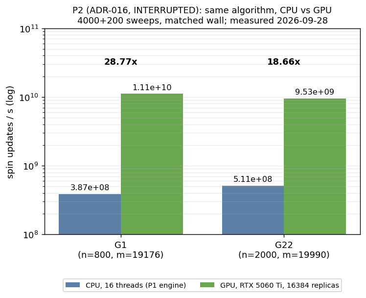
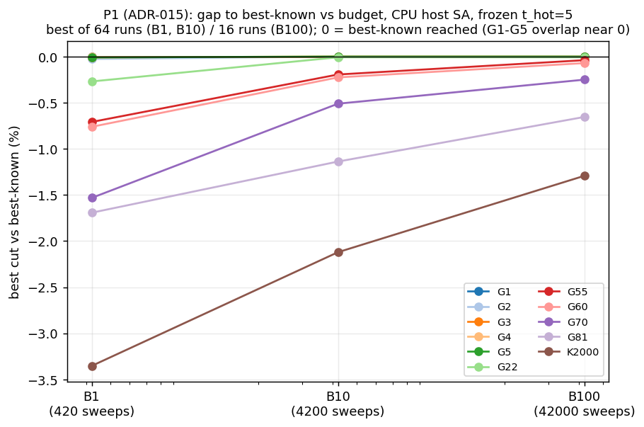
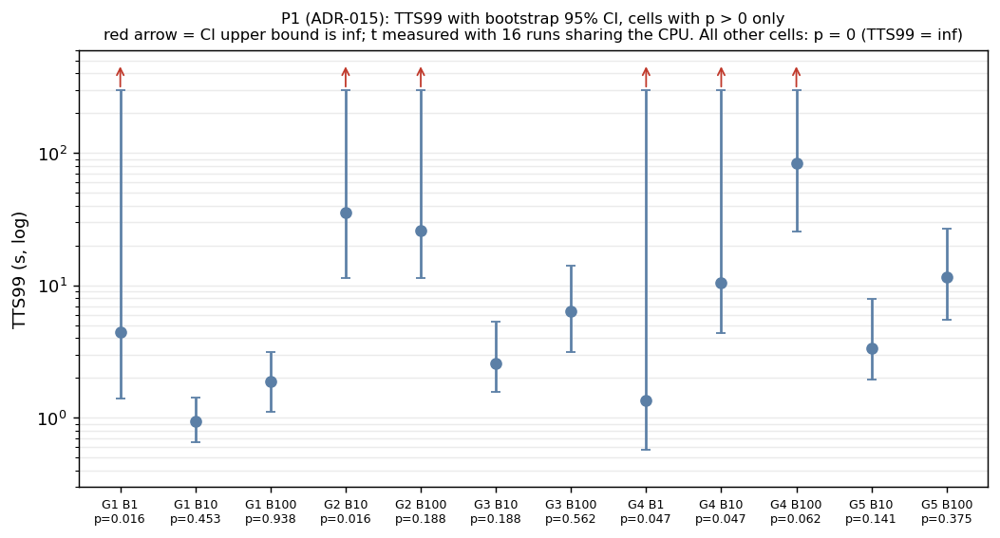
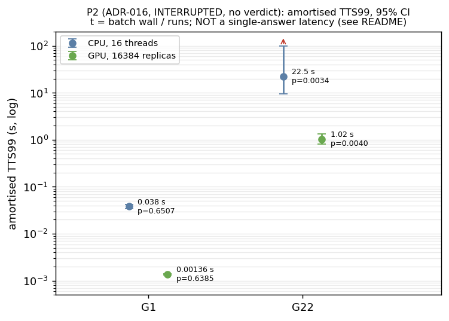
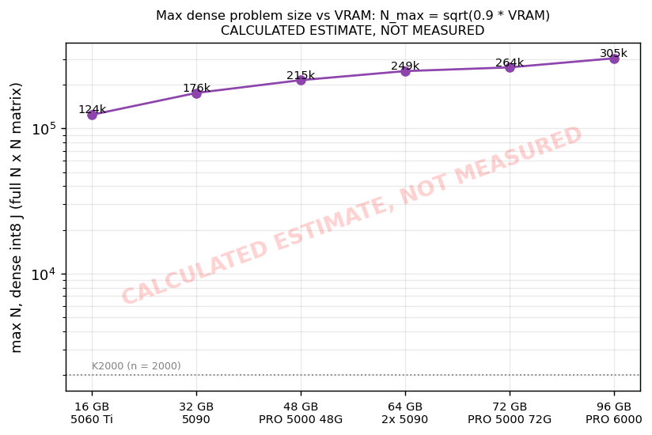
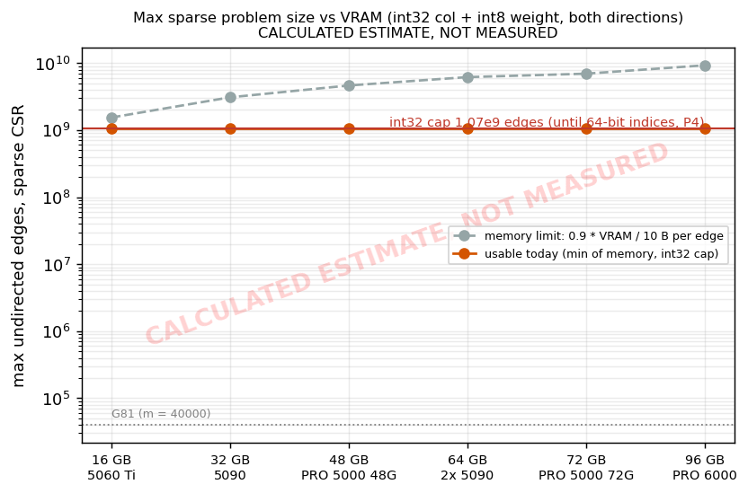
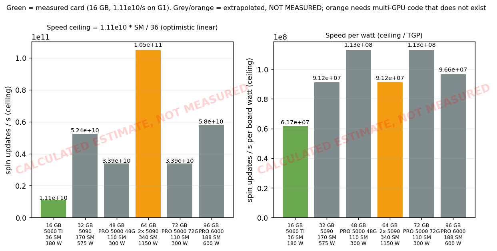

# Benchmarks

Charts and tables drawn from the committed experiment CSVs. Regenerate everything (CPU only, no GPU is touched):

```
python tools/render_benchmarks.py
```

Inputs: `experiments/p1_bench/summary.csv` (P1, ADR-015), `experiments/p2_gpu/summary.csv` and `throughput.csv`
(P2, ADR-016, **interrupted, no verdict**), and `gpu_specs.csv` here. Machine for every measured number:
RTX 5060 Ti 16 GB (sm_120, 36 SM, 180 W), Xeon E5-2683 v4 16C/32T, Windows, CUDA 13.0, 2026-09-28.

Sections 1–4 are **measured**. Section 5 is **calculated, not measured**.

## 1. CPU vs GPU throughput (P2, G1 and G22)



Same algorithm (the P1 integer engine), same schedule (4000 + 200 sweeps, T_hot = σ, T_cold = 0.1), matched wall
time. GPU 1.114e10 and 9.53e9 spin updates/s vs 16 CPU threads at 3.87e8 and 5.11e8: **28.77× and 18.66×**.
Assignments identical on every shared seed (584/584, 892/892). G81 and K2000 were not run
([RESULTS_PARTIAL](../../experiments/p2_gpu/RESULTS_PARTIAL.md), [KL-011](../KNOWN_LIMITS.md#kl-011)).

## 2. P1: gap to best-known vs budget



CPU host SA, frozen t_hot = 5, budgets B1/B10/B100 = 420/4200/42000 sweeps. G1–G5 reach their best-known cut
from B10 on; G22 stops one short (13358); the larger and ±1 graphs close their gap with budget but never reach it;
K2000 stays 1.3 % short at B100 because the unscaled schedule is too cold ([KL-004](../KNOWN_LIMITS.md#kl-004)).

## 3. P1: TTS99 with 95 % CI (cells with p > 0)



TTS99 = t·ln(0.01)/ln(1−p), bootstrap CI (B = 2000). t is the per-run wall time with 16 runs sharing the CPU.
Red arrows mark an infinite upper bound (a resample with p* = 0). All 21 other cells have p = 0.

## 4. P2: CPU vs GPU TTS99, amortised, with CI



Amortised t = batch wall / runs (ADR-016 §5): G1 GPU 0.00137 s vs CPU 0.0380 s; G22 GPU 1.02 s [0.81, 1.33] vs
CPU 22.5 s [9.6, inf]. **This is a throughput figure, not a time to one answer**: the GPU returns nothing before
its batch ends (4.9 s on G1, 14.4 s on G22). No comparison with published solvers is claimed; see
[RESULTS_PARTIAL](../../experiments/p2_gpu/RESULTS_PARTIAL.md#how-to-read-the-two-tts-numbers).

## 5. VRAM planning — CALCULATED ESTIMATES, NOT MEASURED

**Key message: VRAM sets the problem size; SM count sets the speed.** A 48 GB or 72 GB RTX PRO 5000 (110 SM)
would hold bigger dense problems than an RTX 5090 (170 SM, 32 GB) but would run QuBLAR *slower*. For sparse
problems, the int32 index cap ([KL-003](../KNOWN_LIMITS.md#kl-003)) binds before VRAM on every card from 16 GB up,
so extra VRAM buys nothing there until P4 moves to 64-bit indices.

Only one number in this section is measured: 1.11e10 spin updates/s on the RTX 5060 Ti (G1, shared-memory state).
Everything else is arithmetic on public specs.

### Formulas

- usable = 0.9 × VRAM × 2^30 bytes (VRAM in GiB; "16 GB" is taken as 16 GiB).
- Dense int8 J (full N × N matrix, 1 byte per entry): **N_max = floor(sqrt(usable))**.
- Sparse CSR, both directions, int32 column + int8 weight = 2 × 5 = **10 B per undirected edge**:
  **edges_max = min(usable / 10, 1.07e9)**; 1.07e9 = 2^31 / 2 is the int32 cap until 64-bit indices.
- Speed ceiling = **1.11e10 × SM / 36** spin updates/s (linear in SM count from the one measured card —
  optimistic and unmeasured: it ignores clocks, memory bandwidth, global-memory state for large n, and
  multi-GPU overhead). Speed per watt = ceiling / board power (TGP).

Per-replica state, the field array, the RNG and the OS/driver share are inside the 10 % margin; that is an
assumption, not a measurement.

### Table (from `vram_planning.csv`)

| VRAM | example card | SM | W | dense int8 N_max | sparse edges max | int32-capped | speed ceiling (/s) | per W | multi-GPU code |
|---:|---|---:|---:|---:|---:|---|---:|---:|---|
| 16 GB | RTX 5060 Ti 16GB (measured 1.11e10/s) | 36 | 180 | 124,345 | 1.07e9 | yes | 1.11e10 | 6.17e7 | no |
| 32 GB | RTX 5090 | 170 | 575 | 175,851 | 1.07e9 | yes | 5.24e10 | 9.12e7 | no |
| 48 GB | RTX PRO 5000 Blackwell 48GB | 110 | 300 | 215,373 | 1.07e9 | yes | 3.39e10 | 1.13e8 | no |
| 64 GB | 2x RTX 5090 (no single 64 GB card known) | 340 | 1150 | 248,691 | 1.07e9 | yes | 1.05e11 | 9.12e7 | **yes (does not exist)** |
| 72 GB | RTX PRO 5000 Blackwell 72GB | 110 | 300 | 263,777 | 1.07e9 | yes | 3.39e10 | 1.13e8 | no |
| 96 GB | RTX PRO 6000 Blackwell Workstation | 188 | 600 | 304,583 | 1.07e9 | yes | 5.80e10 | 9.66e7 | no |

The 64 GB row assumes a problem split across two cards; QuBLAR has no multi-GPU code, so on one 5090 the
single-problem limits are the 32 GB row's. Memory-only sparse limits (before the cap) range from 1.55e9 edges
(16 GB) to 9.28e9 (96 GB).

### Charts







The PRO 5000 cards score best on speed *per watt* under this model (110 SM at 300 W), but their absolute ceiling
(3.39e10/s) is below the 5090's (5.24e10/s). The measured 5060 Ti already runs at its 180 W limit under full
load ([KL-001](../KNOWN_LIMITS.md#kl-001)); any bigger card draws 300–600 W.

### Card specs

`gpu_specs.csv` — **public specs, verify before purchase.** SM counts and board power checked on 2026-09-28
against: NVIDIA RTX 5060 family page (36 SM implied by 4,608 CUDA cores at 128 per SM; 180 W), NVIDIA RTX
Blackwell architecture whitepaper (RTX 5090: 170 SM, 575 W), NVIDIA RTX PRO Blackwell architecture whitepaper
(RTX PRO 6000: 188 SM, 600 W; PRO 5000: 300 W), PNY RTX PRO 5000 72GB page (14,080 CUDA cores = 110 SM, 300 W).
URLs are in the CSV.
